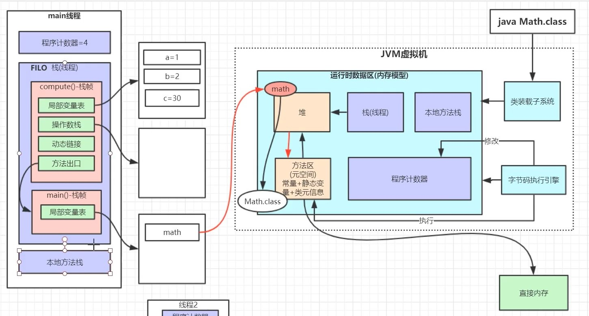
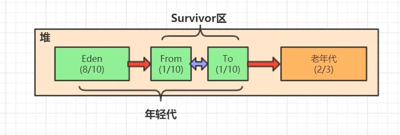
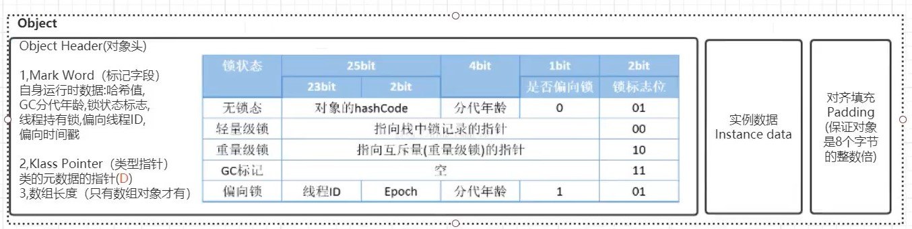

# Java底层了解

## 1.Java虚拟机（JVM）

---

###1.1 Java虚拟机的组成

----

JVM由三部分组成

> 类装载子系统
>
> 字节码执行引擎
>
> 运行时数据区（数据模型）包括
> 1. 堆
> 2. 栈（线程）
> 3. 本地方法区
> 4. 方法区（元空间）
> 5. 程序计数器



[JVM指令查询](https://www.cnblogs.com/lsy131479/p/11201241.html)

####1.1.1栈、程序计数器和本地方法栈

---

栈区域也可以称作线程区域，栈会为线程内的方法创建栈帧，栈空间内FILO(first in last out)先进后出

> 局部变量表
>
> 操作数栈
>
> 动态链接
>
> 方法出口

其中带有的程序计数器会录程序当前运行到的行数，当此线程被挂起后还可恢复进程，其中Code7~9是为了数据在内存中的连续性而定的，因为Code:7占用了两个字节

iconst会把数值压入操作数栈

方法出口会在方法被调用时记录返回时的指向

```java
Code:
       0: iconst_1	//将int类型常量1压入栈
       1: istore_1	//将int类型值存入局部变量1
       2: iconst_2	//将int类型常量2压入栈
       3: istore_2	//将int类型值存入局部变量2
       4: iload_1	//从局部变量1中装载int类型值
       5: iload_2	//从局部变量2中装载int类型值
       6: iadd		//执行int类型的加法
       7: bipush        10	//将一个8位带符号整数压入栈
       9: imul		//执行int类型的乘法
      10: istore_3	//将int类型值存入局部变量3
      11: iload_3	//从局部变量3中装载int类型值
      12: ireturn	//从方法中返回int类型的数据
          
iconst_1 将int类型常量1压入栈
istore_1 将int类型值存入局部变量1
iconst_2 将int类型常量2压入栈
istore_2 将int类型值存入局部变量2
iload_1 从局部变量1中装载int类型值
iload_2 从局部变量2中装载int类型值
iadd 执行int类型的加法
bipush       10 将一个8位带符号整数压入栈
imul 执行int类型的乘法
istore_3 将int类型值存入局部变量3
iload_3 从局部变量3中装载int类型值
ireturn 从方法中返回int类型的数据
```


####1.1.2堆

---



和垃圾回收机制（GC）紧密相连

Eden区储存最新的对象，当Eden充满后会进行minor gc将无gc root的对象进行回收多余的存入From，Eden再次存满后将再次minor gc，多余的存入To中，每次进行minor gc都会对其年龄加1，默认15代后进入老年区。当老年区满后会进行一次Full gc，会暂停当前线程，对性能和执行时间影响较大。


####1.1.3  方法区（元空间）

---

元空间中会在类装载时存储类中的常量、静态变量和类元信息，对同一个类的两个对象，在堆中是指向方法区中同一个区域的

//暂时不懂

